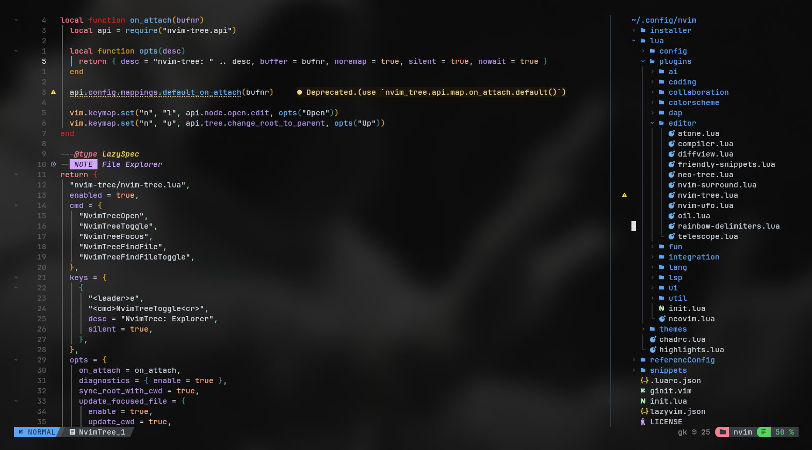
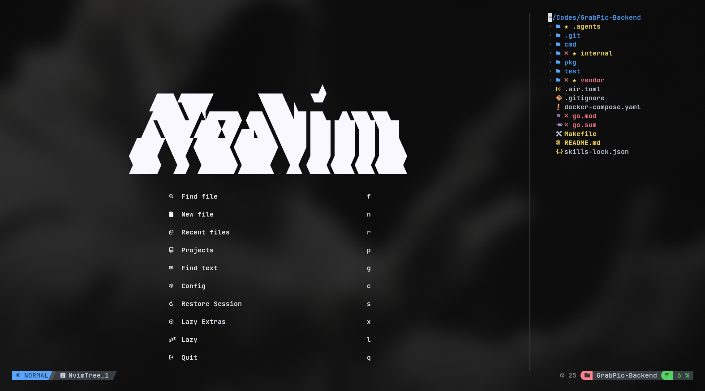
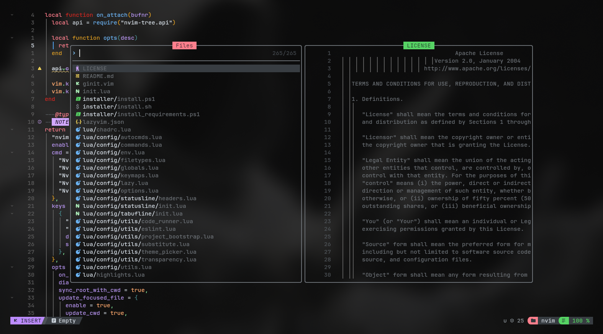
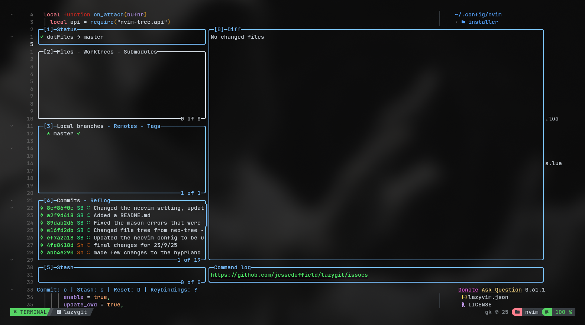

# dotfiles

<div align="center">
  

Personal Linux development environment configuration, centered around a modular Neovim setup, Hyprland desktop workflow, Kitty terminal, and Zsh shell tooling.
</div>

## Overview

This repository contains my day-to-day dotfiles for a Wayland-based Linux setup.

- Editor: `Neovim` (LazyVim + NvChad hybrid, with custom Lua modules)
- Desktop: `Hyprland` + `hypridle` + `hyprlock`
- Terminal: `kitty`
- Shell: `zsh` + `zinit` + `powerlevel10k`
- System info: `fastfetch` with custom image/logo layout

> [!NOTE]
> The Neovim config is the most actively customized part of this repository and is documented in detail below.

## Contents

- [Quick start](#quick-start)
- [Repository structure](#repository-structure)
- [Screenshots](#screenshots)
- [Neovim configuration deep dive](#neovim-configuration-deep-dive)
- [Other configs (quick overview)](#other-configs-quick-overview)
- [Troubleshooting](#troubleshooting)

## Quick start

### 1) Clone

```bash
git clone https://github.com/ShayantanBose/dotfiles.git
cd dotfiles
```

### 2) Back up existing configs

```bash
mv ~/.config/nvim ~/.config/nvim.bak 2>/dev/null
mv ~/.config/hypr ~/.config/hypr.bak 2>/dev/null
mv ~/.config/kitty ~/.config/kitty.bak 2>/dev/null
mv ~/.config/fastfetch ~/.config/fastfetch.bak 2>/dev/null
mv ~/.zshrc ~/.zshrc.bak 2>/dev/null
mv ~/.p10k.zsh ~/.p10k.zsh.bak 2>/dev/null
```

### 3) Symlink configs

```bash
ln -sfn "$(pwd)/.config/nvim" ~/.config/nvim
ln -sfn "$(pwd)/.config/hypr" ~/.config/hypr
ln -sfn "$(pwd)/.config/kitty" ~/.config/kitty
ln -sfn "$(pwd)/.config/fastfetch" ~/.config/fastfetch
ln -sfn "$(pwd)/.zshrc" ~/.zshrc
ln -sfn "$(pwd)/.p10k.zsh" ~/.p10k.zsh
```

### 4) Launch

- Open `nvim` once to bootstrap plugins.
- Restart your shell (`exec zsh`) to load `zinit`/prompt plugins.
- Reload Hyprland config with `hyprctl reload` (or relogin).

> [!TIP]
> If you only want the editor, you can symlink just `~/.config/nvim` and ignore the rest.

## Repository structure

```text
.
├── .config/
│   ├── fastfetch/
│   ├── hypr/
│   ├── kitty/
│   └── nvim/
├── .p10k.zsh
└── .zshrc
```

---

## Screenshots

Below is a quick visual tour of the setup. Each image highlights a different part of the workflow, presented in a simple grid layout.

<table>
  <tr>
    <td width="50%">
      <strong>File Explorer</strong><br />
      Focused project navigation with a clean, low-noise tree view.
    </td>
    <td width="50%">
      <strong>Home Dashboard</strong><br />
      A calm, centered landing view for daily edits and quick access.
    </td>
  </tr>
  <tr>
    <td>
      
    </td>
    <td>
      
    </td>
  </tr>
  <tr>
    <td width="50%">
      <strong>File Picker</strong><br />
      Fast, fuzzy file search optimized for keyboard flow.
    </td>
    <td width="50%">
      <strong>Git TUI</strong><br />
      Staged changes and history in a tight, terminal-first UI.
    </td>
  </tr>
  <tr>
    <td>
      
    </td>
    <td>
      
    </td>
  </tr>
</table>

## Neovim configuration deep dive

The Neovim setup is a hybrid architecture:

- `LazyVim` provides the base distribution and extras ecosystem.
- `NvChad UI` components provide theme/statusline/tabline capabilities.
- Custom Lua modules provide workflow automation, project bootstrap, code execution, and environment-aware behavior.

### High-level boot flow

`init.lua` loads these in order:

1. `config.lazy` - bootstraps `lazy.nvim` and registers plugin specs.
2. `config.commands` - custom user commands.
3. `config.filetypes` - extra filetype mappings.
4. `config.utils` - utility module exports.

Key files:

- `/.config/nvim/init.lua`
- `/.config/nvim/lua/config/lazy.lua`
- `/.config/nvim/lua/plugins/init.lua`

### Architecture and module layout

The plugin layer is split by concern, not by single monolithic file:

- `plugins/ai` - Copilot, OpenCode-related integrations.
- `plugins/coding` - completion behavior (Blink config).
- `plugins/editor` - navigation, trees, telescope, surround, folds, etc.
- `plugins/lsp` - LSP composition + per-server settings.
- `plugins/dap` - debugger setup and adapters.
- `plugins/ui` - statusline/tabline/noice/snacks.
- `plugins/lang` - language-ecosystem specific helpers (for example `.NET`, Java, Flutter).
- `plugins/integration`, `plugins/util`, `plugins/fun` - ecosystem and QoL tooling.

This keeps the config easy to extend: adding one behavior usually means dropping one Lua file in the right category.

### LazyVim + extras strategy

`lazyvim.json` enables a broad set of extras (LSP, UI, DAP, formatting, testing, language packs). The setup is intentionally wide, then narrowed at runtime where needed.

Examples of enabled extras include:

- coding: snippets, comments, surround
- editor: aerial, inc-rename, refactoring, neo-tree, overseer
- lang: TypeScript, Vue, Svelte, Astro, Rust, Go, Java, Python, Zig, Tailwind, YAML, and more
- ui/util: alpha dashboard, treesitter-context, rest client, dot support

### Runtime environment safeguards

The config avoids hard-failing on missing external runtimes:

- `plugins/lsp/mason-runtime-guard.lua` filters mason packages/servers when runtime dependencies are missing (for example `dotnet`, `gem`, `R`).
- `config/env.lua` prepends Mason and lazy-rocks bins to `PATH` so tools are available in editor sessions.
- `config/globals.lua` records OS info and path separators globally (`vim.g.path_separator`, `vim.g.path_delimiter`) for cross-platform utility code.

### LSP design

LSP is configured with a dynamic override model:

- Base layer from LazyVim/LSPConfig.
- Per-server overrides under `plugins/lsp/settings/*.lua`.
- `plugins/lsp/nvim-lspconfig.lua` auto-discovers every settings file and deep-merges it into server opts.

Why this approach works well:

- Adding new server config is just adding one file.
- No giant central `if server == ...` switch.
- Easy to keep language settings isolated and reviewable.

On `LspAttach`, custom autocommands also:

- clear semantic token highlight groups for consistent visuals/perf,
- populate workspace-wide diagnostics (when plugin available).

### DAP and debugging model

Debugging is handled via `nvim-dap` + mason adapter management:

- adapter setup files live in `plugins/dap/settings/`
- `mason-nvim-dap` is configured for automatic installation behavior
- DAP UI opens on attach/launch events

This layout mirrors the LSP design: adapters are isolated by file, making per-language debugging easier to maintain.

### UI system (theme/statusline/tabline)

The UI has a dual mode:

- when colorscheme is `nvchad`, use NvChad-style statusline/tabufline modules;
- otherwise, use `lualine` + `bufferline` variants.

Core UI files:

- `/.config/nvim/lua/chadrc.lua`
- `/.config/nvim/lua/highlights.lua`
- `/.config/nvim/lua/config/statusline/init.lua`
- `/.config/nvim/lua/config/tabufline/init.lua`

Highlights are split into:

- overrides of existing groups (`M.override`)
- additional custom groups (`M.add`)

This keeps theme adjustments explicit and easy to diff.

### Autocommands and editing behavior

`config/autocmds.lua` implements workflow-focused automation:

- terminal windows open in insert mode with line numbers disabled
- auto-save on `FocusLost`, `BufLeave`, `InsertLeave` for regular file buffers
- mode-aware search highlighting toggles
- file reload notification when external edits are detected
- periodic `checktime` loop to catch external modifications
- quickfix helper mapping (`dd` removes current quickfix item)
- transparency re-apply hooks on colorscheme/window/filetype events

### Custom utility layer

The utility module (`config/utils.lua`) re-exports focused helpers:

- `code_runner.run_code()` (`<leader>ce`) - run/compile based on extension, with selectable command variants.
- `project_bootstrap.bootstrap_project()` (`<leader>P`) - interactive project scaffolding across frontend/backend/fullstack/python/mobile categories.
- ESLint helpers for project lint workflows.
- theme picker / transparency toggles.

The project bootstrap module is especially feature-rich:

- framework category selection
- framework-specific creation commands
- Spring Boot metadata + dependency-driven initialization
- Laravel starter-kit flow
- optional post-create git init + initial commit

### Key mappings to know first

Selected high-impact mappings:

- `<leader>ce` - execute current file/project run command
- `<leader>P` - project bootstrap wizard
- `<leader>y` - yank whole buffer to system clipboard
- `<leader>bs` - write with sudo (`SudaWrite`)
- `<leader>le` - open Lazy extras manager
- `<leader>uC` - colorscheme picker
- `<leader>oT` - toggle transparency
- `<C-h/j/k/l>` - smart Neovim/Tmux pane navigation

### AI integration state

Current AI-related configuration in this repo:

- `copilot.lua`: enabled on `InsertEnter`, with `.env*` shell file guard.
- `opencode.nvim`: configured and available under `<leader>a...`.
- `supermaven`: present but currently disabled.

### File explorers and navigation

This setup keeps multiple navigation tools available for different contexts:

- `nvim-tree` enabled (`<leader>e`)
- `oil.nvim` enabled (`<leader>O` toggle behavior)
- `neo-tree` plugin definition present but disabled

### Installation options for Neovim config

Inside `/.config/nvim/installer/` there are helper scripts:

- `install.sh` (Linux/macOS style flow)
- `install.ps1` and `install_requirements.ps1` (Windows/Scoop flow)

> [!IMPORTANT]
> The installer scripts currently clone a standalone `nvim-config` repository URL. If you are installing from this dotfiles repo directly, use symlinks/manual setup from [Quick start](#quick-start).

### How to customize safely

Recommended extension workflow:

1. Add/modify options in `config/options.lua` and globals in `config/globals.lua`.
2. Add plugin config as a new file in the appropriate `plugins/*` category.
3. Add server-specific LSP settings under `plugins/lsp/settings/<server>.lua`.
4. Add keymaps in `config/keymaps.lua` with clear `desc` values.
5. Keep custom logic in `config/utils/*` to avoid bloating keymaps/plugin specs.

This structure scales well and keeps merge conflicts low.

---

## Other configs (quick overview)

### Hyprland (`.config/hypr`)

- Main compositor config in `hyprland.conf` (workspace binds, floating rules, animation/decoration/input).
- Idle and lock behavior in `hypridle.conf` and `hyprlock.conf`.
- Includes Ax-Shell sourced config for theme/color integration.

### Kitty (`.config/kitty`)

- `kitty.conf` defines font (`MapleMono`), opacity, window sizing/padding, and resize keymaps.
- `theme.conf` defines the color palette.

### Zsh (`.zshrc`, `.p10k.zsh`)

- Plugin manager: `zinit`.
- Prompt: `powerlevel10k`.
- Integrations: `fzf`, `zoxide`, NVM, Android SDK paths, Homebrew shellenv.

### Fastfetch (`.config/fastfetch`)

- Uses custom image logo and module block formatting for a themed system summary.

## Troubleshooting

> [!WARNING]
> Most Neovim startup issues come from missing external binaries, not Lua syntax.

- If LSP/tools are missing: run `:Mason` and verify required runtimes (`node`, `python`, `dotnet`, `java`, etc.).
- If UI behaves unexpectedly after theme changes: restart Neovim and re-run `<leader>uC`.
- If keymaps conflict: check plugin-local maps first, then `config/keymaps.lua`.
- If external file edits are not reflected: run `:checktime` manually to verify watcher behavior.
